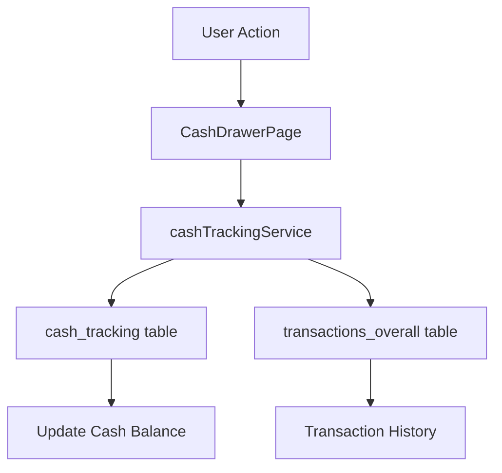

# Cash Drawer System Documentation

## Overview
The Cash Drawer system is a comprehensive solution for tracking and managing cash movements within the POS system. It integrates with the overall transaction system to maintain a complete audit trail of all cash-related activities.

## Components

### 1. Cash Drawer Page (`CashDrawerPage.tsx`)
- **Purpose**: Provides UI for managing and monitoring cash movements
- **Features**:
  - Real-time cash balance display
  - Cash addition/removal interface
  - Transaction history view
  - Date-based filtering
  - Branch-specific cash tracking
  - Cash flow charts and statistics

### 2. Cash Tracking Service (`cashTrackingService.ts`)
- **Purpose**: Manages all cash-related data operations
- **Key Functions**:
  - `createCashTracking`: Creates new cash movement records
  - `updateCashForSale`: Handles cash updates for sales
  - `updateCashForReturn`: Processes cash returns
  - `updateCashManually`: Manages manual cash adjustments
  - `getCashTrackingRecords`: Retrieves cash movement history
  - `getLatestCashTracking`: Gets current cash balance

### 3. Transaction Integration
- **Purpose**: Syncs cash movements with the overall transaction system
- **Process**:
  1. Cash movement recorded in `cash_tracking` table
  2. Corresponding transaction created in `transactions_overall`
  3. Both records linked via `tracking_id`
  4. Business details fetched from profiles (owner/manager)

## Data Flow

### 1. Cash Movement Recording


### 2. Data Structure
- **Cash Tracking Record**:
  ```typescript
  {
    tracking_id: string;
    business_code: string;
    business_branch_name: string;
    cashier_name: string;
    previous_total_cash: number;
    new_total_cash: number;
    cash_additions: number;
    cash_removals: number;
    total_returns: number;
    transaction_date: string;
  }
  ```
- **Transaction Record**:
  ```typescript
  {
    transaction_id: string;
    business_code: string;
    business_name: string;
    branch_name: string;
    transaction_type: 'cash_addition' | 'cash_removal' | 'cash_return';
    amount: number;
    payment_method: 'cash';
    details: {
      previous_total_cash: number;
      new_total_cash: number;
      cashier_name: string;
      tracking_id: string;
    }
  }
  ```

## Business Rules

### 1. Cash Movement Types
- **Additions**: 
  - Sales transactions
  - Manual cash deposits
  - Positive amount in transactions
- **Removals**:
  - Manual withdrawals
  - Expense payments
  - Negative amount in transactions
- **Returns**:
  - Product returns
  - Refunds
  - Negative amount in transactions

### 2. Access Control
- **Cashiers**: 
  - Limited to their assigned branch
  - Can process sales and returns
  - View branch-specific history
- **Managers/Owners**:
  - Access to all branches
  - Can perform manual adjustments
  - View complete transaction history

### 3. Data Integrity
- Each cash movement requires:
  - Previous and new cash balance
  - Movement reason
  - Cashier identification
  - Branch specification
  - Business code validation

## Error Handling

### 1. Business Name Resolution
- Fetches from profiles table
- Accepts both owner and manager profiles
- Falls back to business_code if not found
- Handles multiple profile scenarios
```typescript
// Example of business name resolution
const businessName = await getBusinessName(businessCode);
// Returns first matching owner/manager profile name or business code
```

### 2. Transaction Synchronization
- Ensures both cash_tracking and transactions_overall records are created
- Maintains consistent amounts and types
- Preserves audit trail through tracking_id

## Reporting and Analytics

### 1. Available Metrics
- Daily cash flow
- Total additions/removals
- Return statistics
- Branch-wise comparisons
- Period-based analysis

### 2. Data Visualization
- Cash flow charts
- Transaction type breakdown
- Time-based trends
- Balance history

## Future Enhancements
1. Real-time cash balance notifications
2. Multi-currency support
3. Advanced cash forecasting
4. Automated cash reconciliation
5. Integration with external accounting systems

## Best Practices
1. Always verify cash balance before operations
2. Document all manual adjustments
3. Regular reconciliation of physical cash
4. Maintain detailed transaction notes
5. Regular backup of cash tracking data
